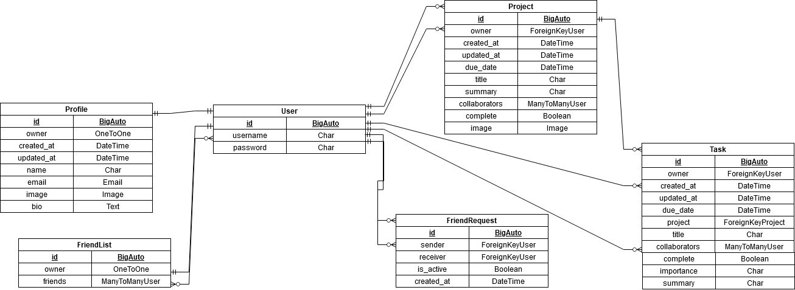

# **Forget Me Not**
## **Site Overview**
Based on the creator's very real need to organise their big projects into nice little bite chunks: this website is designed for people wanting to organise their own work or their team's work into easily accesible and clear tasks.

Forget me Not provides users with the ability to create projects along with assigning people from their friends list as project collaborators so that the workloads of large and intimidating projects can be shared between a team of individuals.

[Deployed site](Be sure to add a site name.)

# **Table Of Contents**
- [**Time to Dine**](#time-to-dine)
  - [**Site Overview**](#site-overview)
- [**Table Of Contents**](#table-of-contents)
- [**Planning Stage**](#planning-stage)
  - [**Target Audience**](#target-audience)
  - [**User Stories**](#user-stories)
  - [**Site Aims**](#site-aims)
  - [**Site Flow Diagram**](#site-flow-diagram)
  - [**Database model**](#database-model)
  - [**Design**](#design)
- [**Agile Development Process**](#agile-development-process)
  - [**Overview**](#overview)
  - [**Admin**](#admin)
  - [**Home Page**](#home-page)
  - [**Registeration**](#registeration)
  - [**Recipe Page**](#recipe-page)
  - [**My recipes page**](#my-recipes-page)
  - [**Add Recipe Page**](#add-recipe-page)
  - [**Exceptions**](#exceptions)
    - [**Star Rating**](#star-rating)
    - [**Categories and Portions**](#categories-and-portions)
- [**Features**](#features)
  - [**Multiple Pages**](#multiple-pages)
    - [**Navbar**](#navbar)
      - [**Default**](#default)
      - [**Signed Out**](#signed-out)
      - [**Signed In**](#signed-in)
      - [**Hamburger Icon**](#hamburger-icon)
    - [**Messages**](#messages)
      - [**Signing In, Up or Out**](#signing-in-up-or-out)
      - [**Commenting**](#commenting)
    - [**Hero Image**](#hero-image)
    - [**Default Image**](#default-image)
    - [**Footer**](#footer)
  - [**Home Page**](#home-page-1)
    - [**Recipe Cards**](#recipe-cards)
    - [**Paginate Link**](#paginate-link)
    - [**Links to other pages**](#links-to-other-pages)
  - [**Categories Pages**](#categories-pages)
  - [**Recipe Form Pages**](#recipe-form-pages)
    - [**Add Recipe Page**](#add-recipe-page-1)
      - [**Unique Title**](#unique-title)
      - [**Required**](#required)
      - [**Ingredients comma separation**](#ingredients-comma-separation)
      - [**Instructions**](#instructions)
      - [**Unauthorised**](#unauthorised)
    - [**Update Recipe Page**](#update-recipe-page)
    - [**Submit/Delete Recipe Pages**](#submitdelete-recipe-pages)
      - [**Author Only**](#author-only)
  - [**Recipe Page**](#recipe-page-1)
    - [**Viewer Contribution**](#viewer-contribution)
      - [**Comments**](#comments)
      - [**Commenting**](#commenting-1)
      - [**Star Rating**](#star-rating-1)
      - [**Restricted Access**](#restricted-access)
  - [**My Recipes Page**](#my-recipes-page-1)
    - [**Recipe Status**](#recipe-status)
  - [**AllAuth Pages**](#allauth-pages)
    - [**Sign Up:**](#sign-up)
    - [**Sign In:**](#sign-in)
    - [**Logout:**](#logout)
  - [**Error Pages**](#error-pages)
    - [**Error 404:**](#error-404)
    - [**Error 500:**](#error-500)
- [**Future Development**](#future-development)
- [**Testing Phase**](#testing-phase)
  - [**Bugs**](#bugs)
    - [**Unresolved Bugs**](#unresolved-bugs)
  - [**Verifiers**](#verifiers)
    - [**HTML**](#html)
      - [**base.html**](#basehtml)
      - [**index.html**](#indexhtml)
      - [**recipe\_page.html**](#recipe_pagehtml)
      - [**my\_recipes.html**](#my_recipeshtml)
      - [**add\_recipe.html**](#add_recipehtml)
      - [**submit\_recipe.html**](#submit_recipehtml)
      - [**update\_recipe.html**](#update_recipehtml)
      - [**delete\_recipe.html**](#delete_recipehtml)
      - [**signup.html**](#signuphtml)
      - [**login.html**](#loginhtml)
      - [**logout.html**](#logouthtml)
      - [**404.html**](#404html)
      - [**500.html**](#500html)
  - [**CSS**](#css)
  - [**Python**](#python)
  - [**LightHouse**](#lighthouse)
    - [**Home Page**](#home-page-2)
    - [**Recipe Page**](#recipe-page-2)
    - [**My recipes Page**](#my-recipes-page-2)
    - [**Categories Page**](#categories-page)
    - [**Add Recipe Page**](#add-recipe-page-2)
    - [**Submit Recipe Page**](#submit-recipe-page)
    - [**Update Recipe Page**](#update-recipe-page-1)
    - [**Delete Recipe Page**](#delete-recipe-page)
    - [**Register Page**](#register-page)
    - [**Login Page**](#login-page)
    - [**Logout Page**](#logout-page)
  - [**Manual Testing**](#manual-testing)
- [**Deployment**](#deployment)
- [**Technologies Used**](#technologies-used)
- [**Honourable Mentions**](#honourable-mentions)
- [**Credits**](#credits)

# **Planning Stage**#
## **Target Audience**

- People who are slightly disorganised and need a way of breaking down intimidating pieces of work into smaller, more manageable tasks.
- People who work in groups and need a way of establishing which collaborator needs to do which task.
- People/Companies who oversee a lot of work and need a way of organising the work and workers to see which tasks are the most urgent.
  
## **User Stories**

- As a user, I can use a navbar on all pages so that I can get to any desired page.
- As a User, I can navigate between pages effortlessly so that I can use the website without any page refreshes.
- As a User, I can sign into my profile so that I can access my projects, tasks, and friends list.
- As a user, I can sign up to the website so that I can access all the content available to authenticated users.
- As a user, I can determine clearly whether I am logged in or not so that I can log back in if need be.
- As a user, I can remained logged in (for at least 24 hours) so that I can enjoy my experience without being logged out every 5 minutes.
- As a logged out user, I can see 'sign in' and 'sign up' options so that I can update my signed in status.
- As a user, I can use avatars so that so that I can show off my personality and quickly identify others.
- As a logged in user, I can create projects so that I can organise myself and set clear deadlines.
- As a user, I can view the details of my projects or projects that I'm a colaborator of so that I can see the tasks and deadlines of the project.
- As a logged in user, I can create tasks associated to my projects so that I can break up my projects into bite-sized chunks.
- As a logged in user, I can view my projects' tasks or tasks that I'm associated with so that I can the tasks details.
- As an owner of a project, I can edit or delete my projects or their assoicated tasks so that I can edit or remove any mistakes in any of my projects.
- As a logged in user, I can send a friend request to another user so that I can make them collaborators on my future projects.
- As a user, I can accept or decline any friend requests that were sent to me so that I can confirm whether I want a particular user to work on my projects.
- As a user, I can cancel any friend requests that I sent before they are accepted by the recipient so that I can prevent people that I didn't mean to send requests from seeing my request in the first place.
- As a logged in user, I can see a list of my friends so that I can decide who should be collaborators on my projects and tasks.
- As a project owner, I can edit my projects and tasks so that I can change my projects' collaborators or change any neccessary details regarding the project.
- As a project owner, I can confirm that a project is complete so that I can remove it from my todo projects.
- As a project owner or task collaborator, I can confirm that a task is complete so that I can mark a project's task's completion status is positive.
- As a user, I can attatch a file, such as a word document or a powerpoint file so that I can allow other collaborators to view the work I have done.
- As a user, I can open a calendar so that I can see the deadlines of my projects and my tasks.
- As a user, I can message my friends or fellow collaborators so that I can keep work related discussions in one location.

Unfortunately, the calendar, messaging and sending files were not able to be completed by the final sprint. So were not implemented into the final deployed project.

## **Site Aims**

The Forget Me Not site had two main goals:

1. To allow people to organise their big life or work projects into a clear and categorised space.
2. To provide a place for people to work together by providing the opportunity to allocate project tasks to specific collaborators.

## **Database Model**

At the beginning of the project, I did not know how to make a Friend system, and so the I had made a work in progress model. 

However, further into development, while I learnt how to implement a friend list and friend request system, I had created two replacement models: FriendRequest and FriendList.

Both of these models were created using https://www.drawio.com/
